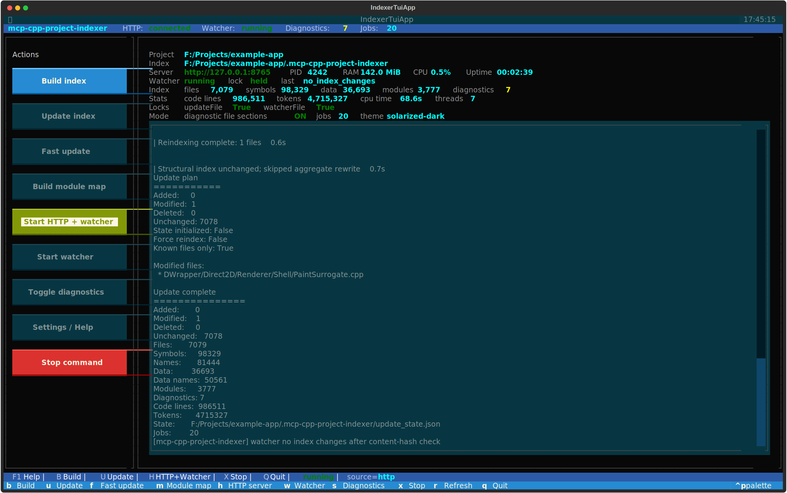

# mcp-cpp-project-indexer

`mcp-cpp-project-indexer` is a deterministic C++ source-range indexer for
large, module-heavy projects and MCP-based AI code navigation.

It is not a compiler, LSP replacement, refactoring engine, semantic analyzer, or call-graph builder.

Its job is simple:

```text
Find code. Read code. Do not guess code.
```

The indexer maps C++ symbols, files, and C++20 modules to exact source ranges so an AI can read only the code it needs.

---

## 30-Second Overview

`mcp-cpp-project-indexer` builds a lightweight routing index over a C++ source
tree. MCP clients can then ask deterministic questions such as:

- where is this function/class/data member?
- which exact source range should be read?
- which module imports or exports this partition?
- which changed hunk intersects which indexed symbol or data range?

The indexer returns metadata and original source ranges. It does not claim to
understand the program. The AI still has to read the returned source and reason
from that evidence.

Minimal workflow:

```text
User asks about Widget::OnScroll
-> find_symbol("Widget::OnScroll")
-> read_symbol(symbolId)
-> AI explains only what was visible in that source range
```

This keeps large C++ projects out of the prompt until exact source evidence is
needed.

---

## 5-Minute Quick Start

### 1. Clone this repository

```powershell
git clone https://github.com/walti1972/mcp-cpp-project-indexer.git
cd mcp-cpp-project-indexer
```

### 2. Build an index for your C++ project

```powershell
python <indexer-root>\build_project_index.py `
  --root <project-root> `
  --output-root <project-root>\.mcp-cpp-project-indexer
```

The generated index is written to:

```text
<project-root>\.mcp-cpp-project-indexer
```

### 3. Start the MCP server

```powershell
python <indexer-root>\code_index_mcp_server.py `
  --project-root <project-root> `
  --index-root <project-root>\.mcp-cpp-project-indexer
```

For multiple MCP clients or a long-running shared process, use HTTP transport:

```powershell
python <indexer-root>\code_index_mcp_server.py `
  --project-root <project-root> `
  --index-root <project-root>\.mcp-cpp-project-indexer `
  --transport http `
  --http-host 127.0.0.1 `
  --http-port 8765
```

### 4. Add the server to your MCP client

Minimal LM Studio-style config:

```json
{
  "mcpServers": {
    "mcp-cpp-project-indexer": {
      "command": "python",
      "args": [
        "<indexer-root>\\code_index_mcp_server.py",
        "--project-root",
        "<project-root>",
        "--index-root",
        "<project-root>\\.mcp-cpp-project-indexer"
      ]
    }
  }
}
```

### 5. Ask for exact source, not whole files

Good first request:

```text
Find the symbol Widget::OnScroll, read its implementation, and explain only
what is visible in the source range.
```

Expected tool path:

```text
find_symbol -> read_symbol -> source-grounded answer
```

For best results, give your AI the rules from
[prompt_template.md](prompt_template.md). The short version is:

```text
Use metadata to locate code. Read exact source ranges before explaining behavior.
Do not infer implementation behavior from metadata alone.
```

---

## Contents

- [5-Minute Quick Start](#5-minute-quick-start)
- [Production Scale & Performance](#-production-scale--performance)
- [TUI Control Center](#tui-control-center)
- [Why This Tool?](#-why-this-tool)
- [Before / After](#-before--after)
- [How It Works](#how-it-works)
- [Core Workflow](#core-workflow)
- [What It Does](#what-it-does)
- [Build And Update](#build-a-project-index)
- [Project Discovery Config](#project-discovery-config)
- [Control Center](#control-center)
- [Start The MCP Server](#start-the-mcp-server)
- [Client Configuration](#lm-studio-mcp-configuration)
- [Possible Workflow Setups](#possible-workflow-setups)
- [Command Line Reference](#command-line-reference)
- [Tool Overview](#tool-overview)
- [Recommended AI Usage Rules](#recommended-ai-usage-rules)
- [Example Workflows](#example-workflows)
- [Design Rules](#design-rules)
- [Development Backstory](#-development-backstory)
- [Smoke Tests](#smoke-tests)
- [Maintenance Checklist](#maintenance-checklist)

---

## 🚀 Production Scale & Performance

This project is used on real C++ codebases, not only toy examples. Two recent
scale runs show the intended range:

| Project | Files | Source lines | Lexer tokens | Symbols | Data declarations | C++20 modules | Full build |
|---|---:|---:|---:|---:|---:|---:|---:|
| Anonymized commercial C++20 project | 7,046 | 979,658 | 4,682,882 | 97,924 | 36,551 | 3,754 | 19.5s |
| Chromium checkout | 137,622 | 30,792,607 | 137,365,399 | 2,327,255 | 818,188 | 0 | ~24m 32s |

These numbers are machine-dependent. The Chromium run used `--jobs 60` on a
high-core workstation with an Intel Xeon Silver 4316 system, 128 GB RAM, and
enterprise NVMe SSD storage. It is a useful public stress test because it
exercises a very large classic include-based C++ codebase, while the anonymized
commercial project exercises dense C++20 module and partition metadata. The
Chromium run also validated the data/member indexer at scale: after fixing
nested-template `>>` depth handling, the public stress test surfaced **46,529**
additional data declarations and **66,866** additional data-name aliases.

The SQLite-backed lookup index keeps server startup practical even at Chromium
scale: the MCP server can start immediately and stay around **200 MB RAM** after
startup instead of loading millions of symbol/data/name entries into Python
objects.

It is designed for workflows that combine the Codex desktop app or other MCP
clients with Visual Studio navigation and, when needed, binary/decompiler
evidence from tools such as IDA Pro.

In one measured workflow, exact source-range routing reduced source text read
from roughly 2,000 lines to 283 lines, an **86% reduction**.

---

## TUI Control Center

For daily use, the indexer includes an optional mouse-capable TUI. It turns the
project index into a small local control center:

- start the HTTP MCP server and watcher from one place
- run full builds, incremental updates, fast updates, and module-map rebuilds
- watch live server, watcher, lock, process, token, and index stats
- inspect build/update logs without switching tools
- toggle diagnostic file sections for deeper parser evidence when needed



Install the optional UI dependency and start the control center with explicit
project/index paths:

```powershell
pip install -r <indexer-root>\requirements-ui.txt

python <indexer-root>\indexer_tui.py `
  --root <project-root> `
  --index-root <project-root>\.mcp-cpp-project-indexer `
  --jobs 20 `
  --http-url http://127.0.0.1:8765
```

The UI is optional; the core indexer remains dependency-light and can still be
driven entirely from scripts or MCP clients. For setup and keyboard shortcuts,
see [Control Center](#control-center).

---

## 💡 Why This Tool?

Large C++ projects are expensive to feed into an AI model when entire files are
loaded just to find one function, class, import, or declaration. C++20 modules
make this harder: many IDE/LSP-style tools still struggle with large module
graphs, partitions, generated SDK headers, and build-specific configuration.

This indexer solves a narrower but very practical problem: it gives the AI a
small, deterministic routing map. The AI can locate the relevant symbol,
module, file, or changed hunk first, then read only the exact original source
lines needed for the task.

Example from a real bug-finding workflow:

```text
Whole file context:     ~2000 source lines
On-demand source reads:  ~283 source lines
--------------------------------------------
Reduction:               ~86% less source text
```

---

## 📊 Before / After

| Standard AI code navigation | With mcp-cpp-project-indexer |
|-----------------------------|------------------------------|
| ❌ AI reads whole files to find a symbol | ✅ AI asks for compact metadata, then reads the exact source range |
| ❌ Context fills with unrelated declarations and implementations | ✅ Context stays focused on the lines that matter |
| ❌ C++20 module consumers/imports are hard to route through | ✅ Module imports, re-exports, partitions, and consumers are exposed directly |
| ❌ Reviews start by scanning changed files manually | ✅ Change hunks are mapped to indexed symbol/data ranges |
| ❌ Tooling may imply semantic certainty it does not have | ✅ The indexer only returns routing facts and original source ranges |

The result is lower token usage, lower latency, less context drift, and more
source-grounded analysis.

---

## How It Works

The indexer deliberately avoids pretending to be a compiler.

1. **Fast token/structure scan**
   Source files are scanned with a lightweight Python lexer and structural
    parser. The output is a deterministic table of contents: files, symbols,
   data declarations, lexical `#include` directives, source ranges,
   diagnostics, and module facts.

2. **C++20 module map**
   Module interfaces, partitions, imports, export-imports, and consumers are
   indexed so the AI can route through module-heavy code without asking an LSP
   to solve the whole build.

3. **Incremental update and watcher**
   The updater tracks content hashes and rewrites only changed index data where
   possible. The optional watcher can keep the MCP server cache fresh while you
   work in Visual Studio.

4. **MCP tools with compact output controls**
   Tools expose exact routing metadata first. The AI escalates only when needed:
   compact symbol lookup, file/module/change overview, exact `read_symbol` or
   `read_range`, then deeper recursive source reads.

The indexer is only the table of contents. The AI performs recursive
exploration and code review from the original source lines it explicitly reads.

---

## Core Workflow

Instead of this:

```text
Read Renderer.cpp completely: ~2000 lines
```

use this:

```text
find_symbol("Renderer::Paint")
read_symbol(symbolId)
inspect visible calls
read only relevant project callees
```

For changed-code review:

```text
list_changed_files
get_file_change_hunks(includeIndexedRangeSummary:true, includeSource:false)
get_file_change_hunks(symbolId/dataId, includeSource:true)
read_symbol/read_range only when current source behavior is needed
```

---

## What it does

The scanner extracts routing facts from C++ source files:

- files and stable file IDs
- C++20 modules and partitions
- lexical `#include` directives
- imports and exports
- namespaces
- classes / structs / enums
- functions / methods
- constructors / destructors / operators
- declarations and inline definitions
- exact `startLine` / `endLine`
- diagnostics for structurally suspicious files

It is stream/token based, not regex based.

---

## What it does not do

Intentionally not included:

- no call graph
- no `find_references`
- no type resolution
- no template-instantiation resolution
- no compiler-accurate overload resolution
- no macro expansion
- no semantic summaries
- no bug analysis
- no `analyze_symbol(symbolId)`

The AI should read source ranges and reason from the original code.

---

## Output layout

Default output directory:

```text
<project-root>/.mcp-cpp-project-indexer/
```

Generated files:

```text
.mcp-cpp-project-indexer/
  manifest.json
  files/
    f_<pathHash>.json
  index.sqlite
  modules.json
  diagnostics.json
  update_state.json      # written by build/update; used for fast incremental updates
  module_map.json        # generated by build_module_map.py
  .watch_update_summary.json  # temporary watcher/update summary
  .update.lock           # process lock for index writers
  .watcher.lock          # process lock for one active watcher
```

Global symbol and data routing indexes are stored in `index.sqlite`. The
per-file JSON indexes remain the source of truth for exact source ranges and
incremental rebuilds.

Optional JSONL export:

```powershell
python <indexer-root>\export_index_jsonl.py --index-root <project-root>\.mcp-cpp-project-indexer --kind symbols --output symbols.jsonl
python <indexer-root>\export_index_jsonl.py --index-root <project-root>\.mcp-cpp-project-indexer --kind data --output data.jsonl
```

Scanner diagnostic file-index fields are emitted only with
`--emit-diagnostics` or `--emit-diagnostic-file-indexes`:

```text
scopeIntervals
structuralEvents
functionBodyRanges
```

---

## Index one file

From any directory:

```powershell
python <indexer-root>\build_file_index.py `
  --file <project-root>\path\to\file.ixx `
  --project-root <project-root> `
  --output <project-root>\.mcp-cpp-project-indexer\diagnostic_file.json
```

With scanner diagnostic data:

```powershell
python <indexer-root>\build_file_index.py `
  --file <project-root>\path\to\file.ixx `
  --project-root <project-root> `
  --output <project-root>\.mcp-cpp-project-indexer\diagnostic_file.json `
  --emit-diagnostics
```

If `--project-root` is omitted, the file's parent directory is used.

---

## Build a project index

Recommended usage from the C++ project root:

```powershell
cd <project-root>
python <indexer-root>\build_project_index.py
```

This writes to:

```text
<project-root>/.mcp-cpp-project-indexer/
```

Explicit form:

```powershell
python <indexer-root>\build_project_index.py `
  --root <project-root> `
  --output-root <project-root>\.mcp-cpp-project-indexer
```

Example summary:

```text
Built cpp.project_index.v1
Root: <project-root>
Output: <project-root>/.mcp-cpp-project-indexer
Files: 7076
Symbols: 97583
Names: 95674
Modules: 3774
Diagnostics: 7
Total code lines: 1750000
Total tokens: 14200000
SQLite index: <project-root>/.mcp-cpp-project-indexer/index.sqlite
```

`Total tokens` is the indexer's lexer token count over the indexed source after
comment blanking. It is a project-size metric, not an LLM billing-token count.

When the project root is inside a Git worktree and `git` is available, file
discovery respects Git ignore rules by filtering candidates through
`git check-ignore --stdin`. This excludes paths matched by `.gitignore`,
`.git/info/exclude`, or the user's global Git ignore file. Non-Git projects, or
systems without Git, fall back to the built-in excluded directory list.
Dot-directories such as `.git`, `.vs`, `.cache`, `.idea`, or `.folder` are
excluded by default.

### Project discovery config

For large projects with mixed source layouts, place `indexer_config.json` in
the project root or in any subdirectory. Config files are applied while walking
the tree: the root config becomes the base, and subdirectory configs can
override or extend it for that subtree.

Example:

```json
{
  "addExtensions": [".mm"],
  "addExcludeDirs": ["generated", "third_party"],
  "includeExtensionlessHeaders": true,
  "useGitIgnore": false
}
```

Supported fields:

```json
{
  "extensions": [".cpp", ".cc", ".h"],
  "addExtensions": [".mm"],
  "removeExtensions": [".c"],
  "excludeDirs": ["out", "build"],
  "addExcludeDirs": ["generated"],
  "removeExcludeDirs": ["third_party"],
  "includeExtensionlessHeaders": true,
  "useGitIgnore": false
}
```

`extensions` and `excludeDirs` replace the inherited values for that subtree.
`add*` and `remove*` fields modify the inherited values. Extensionless header
discovery is conservative and opt-in; it only accepts extensionless files whose
first lines look like C/C++ headers.
`useGitIgnore:false` disables the final `git check-ignore --stdin` pass for
very large repositories where Git ignore filtering is more expensive than an
explicit indexer config.

## Incremental update

After a full index build, changed files can be detected and re-indexed incrementally.

Dry-run:

```powershell
python <indexer-root>\update_project_index.py `
  --root <project-root> `
  --index-root <project-root>\.mcp-cpp-project-indexer `
  --dry-run
```

Fast update for already-indexed files:

```powershell
python <indexer-root>\update_project_index.py `
  --root <project-root> `
  --index-root <project-root>\.mcp-cpp-project-indexer `
  --known-files-only
```

Watcher-style update for a known changed file:

```powershell
python <indexer-root>\update_project_index.py `
  --root <project-root> `
  --index-root <project-root>\.mcp-cpp-project-indexer `
  --known-files-only `
  --changed-file path\to\changed.cpp
```

`--known-files-only` skips full discovery of new files. This is ideal for save/watch loops.
`--changed-file` can be repeated and lets a watcher avoid hashing unchanged files.

Index writes are protected by an exclusive `.update.lock` file in the index
root. This prevents full builds, incremental updates, and module-map rebuilds
from writing the same index files at the same time.

---

## Watch the project index

The standalone watcher polls source files, debounces changes, runs the incremental updater,
and optionally rebuilds `module_map.json`.

```powershell
python <indexer-root>\watch_project_index.py `
  --root <project-root> `
  --index-root <project-root>\.mcp-cpp-project-indexer `
  --jobs 20
```

For pure file modifications, the watcher calls:

```text
update_project_index.py --known-files-only --changed-file <path>
```

This hashes only the changed candidate file. If the content hash did not change,
the watcher skips module-map rebuild and MCP cache reload work.

Only one watcher should own an index root. The watcher uses `.watcher.lock` and
exits if another watcher is already active for the same index.

Diagnostics are non-fatal. They indicate best-effort structural warnings for individual files.

Print diagnostics summary:

```powershell
python -c "import json; from collections import Counter; d=json.load(open(r'<project-root>\.mcp-cpp-project-indexer\diagnostics.json',encoding='utf-8')); print(len(d)); print(Counter(x.get('code') for x in d)); [print(x['relativePath'], x['code'], x['message'], x.get('range')) for x in d]"
```

---

## Build the module map

After building the project index:

```powershell
python <indexer-root>\build_module_map.py `
  --index-root <project-root>\.mcp-cpp-project-indexer
```

Output:

```text
<project-root>/.mcp-cpp-project-indexer/module_map.json
```

The module map contains:

- module names
- primary modules and partitions
- files defining each module
- imports
- importedBy
- a module tree
- unresolved imports

It is metadata only. It does not analyze implementation behavior.

---

## Control Center

The core indexer has no third-party runtime dependencies. For day-to-day
operation there are two optional terminal control surfaces:

- `indexer_tui.py`: a polished mouse-capable Textual UI
- `indexer_control.py`: a dependency-free command-line fallback

Install the optional UI dependency:

```powershell
pip install -r <indexer-root>\requirements-ui.txt
```

Start the Textual UI:

```powershell
python <indexer-root>\indexer_tui.py `
  --root <project-root> `
  --index-root <project-root>\.mcp-cpp-project-indexer `
  --jobs 20 `
  --http-url http://127.0.0.1:8765
```

The Textual UI provides a real terminal interface with buttons, mouse support,
status cards, live HTTP `/status` polling, activity logs, and process control
for build/update/watch/server actions.

Mouse input depends on the terminal emulator. On Windows, use Windows Terminal
or another modern terminal that forwards mouse events to terminal applications.
Keyboard shortcuts work everywhere Textual can run.

UI settings are saved under `<indexer-root>/.ui-settings/` on exit and when
diagnostic file sections are toggled. Each settings file is keyed by project
name plus a path hash, so UI preferences do not write into the project root or
generated index directory. Stored preferences include the HTTP URL, jobs value,
diagnostic-section toggle, management API launch settings, active Textual
theme, and project/index paths.

The settings file can also be edited directly for external Relay UI setups:

```json
{
  "httpUrl": "http://127.0.0.1:8765",
  "jobs": 20,
  "managementApiEnabled": true,
  "managementToken": "local-secret-token",
  "emitDiagnosticFileIndexes": true,
  "theme": "textual-dark"
}
```

The Textual UI has a separate `Start HTTP + management` action. It starts the
HTTP MCP server with watcher and `--enable-management-api`, using the saved
`managementToken` when configured. This action is intentionally local to the
TUI and is not exposed as a management command on the HTTP API.

Fallback control center:

```powershell
python <indexer-root>\indexer_control.py `
  --root <project-root> `
  --index-root <project-root>\.mcp-cpp-project-indexer `
  --jobs 20 `
  --http-url http://127.0.0.1:8765
```

Common keys:

```text
B  full build
U  incremental update
F  fast known-files update
M  rebuild module map
H  start HTTP server with watcher
G  start HTTP server with watcher and management API
W  start standalone watcher
S  toggle diagnostic file sections for launched commands
X  stop the currently running command
R  refresh
Q  quit
```

When the HTTP server is running, both control centers poll `/status` for live
server, watcher, lock, and index stats. If the HTTP server is not reachable,
they fall back to reading `manifest.json` and `module_map.json` from disk.

---

## Dump the module tree

Text tree:

```powershell
python <indexer-root>\dump_module_tree.py `
  --index-root <project-root>\.mcp-cpp-project-indexer
```

Write to file:

```powershell
python <indexer-root>\dump_module_tree.py `
  --index-root <project-root>\.mcp-cpp-project-indexer `
  --output <project-root>\.mcp-cpp-project-indexer\module-tree.txt
```

Import tree for one module:

```powershell
python <indexer-root>\dump_module_tree.py `
  --index-root <project-root>\.mcp-cpp-project-indexer `
  --imports Example.Module:Partition `
  --max-depth 5
```

---

## Start the MCP server

The server reads an existing index. It does not rebuild the index.

```powershell
python <indexer-root>\code_index_mcp_server.py `
  --project-root <project-root> `
  --index-root <project-root>\.mcp-cpp-project-indexer
```

The server is read-only and exposes locator/read tools over MCP stdio.

To let the server keep its in-memory cache current during editing, start it with
the built-in watcher:

```powershell
python <indexer-root>\code_index_mcp_server.py `
  --project-root <project-root> `
  --index-root <project-root>\.mcp-cpp-project-indexer `
  --watch-index `
  --watch-jobs 20
```

The server watcher writes all progress to stderr so stdout remains valid MCP
JSON-RPC. After a real index change, it reloads the server cache automatically.
If a save only changes mtime and the content hash is unchanged, it skips module
map rebuild and cache reload.

If another watcher already owns the same index root, the MCP server continues
read-only and does not start its own watcher. This avoids concurrent writer
processes when multiple MCP clients start separate stdio server instances.

### Shared HTTP transport

For setups where multiple MCP clients would otherwise start separate stdio
server processes, the server can also expose the same JSON-RPC MCP surface over
HTTP:

```powershell
python <indexer-root>\code_index_mcp_server.py `
  --project-root <project-root> `
  --index-root <project-root>\.mcp-cpp-project-indexer `
  --transport http `
  --http-host 127.0.0.1 `
  --http-port 8765 `
  --watch-index `
  --watch-jobs 20
```

The HTTP endpoint is:

```text
POST http://127.0.0.1:8765/mcp
```

Status endpoints:

```text
GET http://127.0.0.1:8765/health
GET http://127.0.0.1:8765/status
```

This keeps one long-running server process, one in-memory index cache, and one
watcher for the index root. Clients that only support stdio still need a stdio
configuration or a small client-side bridge to this HTTP endpoint.

### HTTP management API

External control UIs can optionally enable a small management surface on the
same HTTP server. It is disabled by default because it can start build/update
processes.

```powershell
python <indexer-root>\code_index_mcp_server.py `
  --project-root <project-root> `
  --index-root <project-root>\.mcp-cpp-project-indexer `
  --transport http `
  --http-host 127.0.0.1 `
  --http-port 8765 `
  --enable-management-api `
  --management-token <token>
```

Endpoints:

```text
GET  /management/status
POST /management/command
GET  /management/log?since=<eventId>&limit=<n>
GET  /management/log/stream
GET  /management/server-log?since=<eventId>&limit=<n>
GET  /management/server-log/stream
```

`/management/status` includes a `dashboard` object shaped for external control
centers. It contains the same high-value fields shown by the TUI:

```text
dashboard.project.text
dashboard.index.text
dashboard.server.url / pid / ramText / cpuText / uptimeText
dashboard.watcher.runningText / lockText / last
dashboard.counts.filesText / symbolsText / dataText / modulesText / diagnosticsText
dashboard.stats.codeLinesText / tokensText / cpuTimeText / threadsText
dashboard.locks.updateFile / watcherFile
dashboard.mode.diagnosticFileSectionsText / jobsText / theme
```

Raw numeric values are included next to the formatted `*Text` fields where the
server can provide them. `dashboard.mode.theme` is reserved for external UIs;
the HTTP server itself does not own a visual theme.

Pass the token as either:

```text
Authorization: Bearer <token>
x-api-key: <token>
```

Commands are single JSON objects:

```json
{ "command": "build", "jobs": 20 }
{ "command": "update", "jobs": 20 }
{ "command": "fast_update", "jobs": 20 }
{ "command": "module_map" }
{ "command": "reload_index" }
{ "command": "start_watcher", "jobs": 20 }
{ "command": "stop_watcher" }
{ "command": "stop_command", "wait": true }
```

`/management/log` returns management command output. `/management/log/stream`
is the matching SSE stream. Build and update subprocess output is read
asynchronously, so a UI can keep polling status and streaming logs while large
projects are being indexed.

`/management/server-log` returns recent HTTP/MCP traffic log events, including
request/response byte counts and the MCP method detail where available.
`/management/server-log/stream` is the matching SSE stream for live request
activity.

---

## LM Studio MCP configuration

Example `mcp.json`:

```json
{
  "mcpServers": {
    "mcp-cpp-project-indexer": {
      "command": "python",
      "args": [
        "<indexer-root>\\code_index_mcp_server.py",
        "--project-root",
        "<project-root>",
        "--index-root",
        "<project-root>\\.mcp-cpp-project-indexer"
      ]
    }
  }
}
```

After rebuilding the index or module map, restart the MCP server / LM Studio.

---

## Codex configuration

For Codex, configure this repository as an MCP stdio server and put the agent rules
where Codex will load them as project instructions.

Example MCP server entry:

```toml
[mcp_servers.mcp-cpp-project-indexer]
command = "python"

args = [
  "<indexer-root>\\code_index_mcp_server.py",
  "--project-root",
  "<project-root>",
  "--index-root",
  "<project-root>\\.mcp-cpp-project-indexer",
]
```

The prompt rules from [prompt_template.md](prompt_template.md) should be copied into
an `AGENTS.md` file in the project root that Codex opens, for example:

```text
<project-root>\AGENTS.md
```

Codex reads `AGENTS.md` as repository/project instructions for the current working
tree. If you usually start Codex from a parent workspace instead of the C++ project
root, put the file in that workspace root or open Codex directly in the C++ project
root so the instructions are in scope.

Keep the MCP server configuration and the prompt rules separate:

- MCP config starts the tool server and points it at the generated index.
- `AGENTS.md` tells the agent how to use the tools safely and compactly.

After changing the MCP server configuration or rebuilding the index, restart the
MCP server / Codex session so the updated tool schema is visible.

---

## Claude setup

Claude Code and Claude Desktop use MCP slightly differently, so keep the setup
split by client.

### Claude Code

For Claude Code, put the MCP server configuration in a project-scoped `.mcp.json`
file at the project root if the setup should travel with the repository:

```json
{
  "mcpServers": {
    "mcp-cpp-project-indexer": {
      "type": "stdio",
      "command": "python",
      "args": [
        "<indexer-root>\\code_index_mcp_server.py",
        "--project-root",
        "<project-root>",
        "--index-root",
        "<project-root>\\.mcp-cpp-project-indexer"
      ],
      "env": {}
    }
  }
}
```

Equivalent CLI setup:

```powershell
claude mcp add mcp-cpp-project-indexer --scope project -- `
  python <indexer-root>\code_index_mcp_server.py `
  --project-root <project-root> `
  --index-root <project-root>\.mcp-cpp-project-indexer
```

Copy the rules from [prompt_template.md](prompt_template.md) into Claude Code's
project memory file:

```text
<project-root>\CLAUDE.md
```

Claude Code also supports `.claude/CLAUDE.md`; use that path if you prefer to keep
Claude-specific files under `.claude/`. The important part is that the file is in
the project root that Claude Code opens, otherwise the tool-use rules may not be
loaded.

### Claude Desktop

Claude Desktop uses its application MCP configuration file. On Windows this is
usually:

```text
%APPDATA%\Claude\claude_desktop_config.json
```

Add the server under `mcpServers`:

```json
{
  "mcpServers": {
    "mcp-cpp-project-indexer": {
      "type": "stdio",
      "command": "python",
      "args": [
        "<indexer-root>\\code_index_mcp_server.py",
        "--project-root",
        "<project-root>",
        "--index-root",
        "<project-root>\\.mcp-cpp-project-indexer"
      ],
      "env": {}
    }
  }
}
```

Claude Desktop does not automatically read repository instruction files like
`CLAUDE.md` for arbitrary chats. Paste the relevant rules from
[prompt_template.md](prompt_template.md) into the project/chat instructions you use
with Claude Desktop, or use Claude Code when you need repository-scoped persistent
instructions.

After changing `.mcp.json`, `claude_desktop_config.json`, or rebuilding the index,
restart the Claude client so the updated tool schema is visible.


---

## Possible workflow setups

### Source-grounded bug finding

A practical review workflow is to use `mcp-cpp-project-indexer` as the primary
navigation layer and let the AI reason only from exact source ranges it has read.

Typical flow:

```text
1. User asks:
     Review module X, file X, or function X for bugs.

2. AI uses mcp-cpp-project-indexer:
     find module/file/symbol
     read exact source ranges
     follow only relevant project-local calls
     avoid whole-file reads unless needed

3. AI reports findings:
     file path
     line range
     source-grounded explanation
     uncertainty where more context is needed

4. AI uses Visual Studio MCP only after analysis:
     open the file
     navigate to the exact finding location
```

This keeps the model context clean. The indexer handles routing and token
reduction; the AI performs the analysis from original source lines; Visual Studio
is used as the developer-facing editor handoff.

### Tool priority with Visual Studio MCP

In C++20 module-heavy projects, Visual Studio/IntelliSense/clangd-style tooling
may fail to resolve module symbols reliably enough for AI navigation.

Recommended role split:

```text
mcp-cpp-project-indexer
  Primary navigation layer.
  Use for symbols, files, modules, source ranges, imports, imported-by metadata.

Visual Studio MCP
  Editor and project-state layer.
  Use for opening files, jumping to locations, looking at build/output/editor state.
  Do not use as the primary C++20 module symbol resolver.

IDAPro MCP
  Binary/decompiler layer.
  Use only when source evidence is insufficient, or for ABI, crash, reverse
  engineering, decompiled code, imports/exports, or binary-behavior questions.
```

Prompt rule:

```text
Use mcp-cpp-project-indexer first for C++ source navigation.
Use Visual Studio MCP only when IDE/editor/build state is needed.
Use IDAPro MCP only when the question requires binary or decompiler evidence.
```

### Source plus binary evidence for undocumented APIs

For code that interacts with undocumented Windows components, source evidence may
not be enough. A useful setup is to keep the relevant DLL loaded in IDAPro and let
the AI inspect decompiled/disassembled code only when source-level evidence leaves
behavior unclear.

Example scenario:

```text
Project code uses wrappers around undocumented DirectUI behavior.
IDAPro has dui70.dll loaded.

1. AI uses mcp-cpp-project-indexer first:
     find the project wrapper/function
     read the exact source range
     follow only relevant local calls

2. If behavior is still unclear:
     use IDAPro MCP to inspect the corresponding function, import, export,
     vtable target, or decompiled implementation in dui70.dll

3. AI combines evidence:
     source callsite and wrapper behavior
     binary/decompiler evidence from the undocumented implementation
     final finding with source line ranges and binary evidence notes

4. AI uses Visual Studio MCP only for handoff:
     open the project source file
     navigate to the line that should be reviewed or changed
```

This keeps reverse-engineering work targeted. The AI does not browse the binary
blindly; it enters IDAPro with a source-grounded question. That reduces irrelevant
context, lowers token usage, and helps the model keep the source/binary reasoning
chain intact.

### Why this setup works

The expensive part of AI code review is often not reasoning; it is locating the
small amount of source that actually matters. The indexer reduces the navigation
problem to compact metadata and exact source ranges. Other tools can then stay
focused on what they are good at: IDE interaction, build state, or binary facts.

---

## Command line reference

### `build_file_index.py`

Build one per-file index JSON.

```text
--file PATH                    C++ source/module file to index. Required.
--project-root PATH            Root used for normalized relative paths.
--output PATH                  Output JSON path.
--output-root PATH             Directory used when --output is omitted.
--case-insensitive-paths / --no-case-insensitive-paths
                               Case-fold relative paths before hashing. Default: true.
--blank-comments / --no-blank-comments
                               Blank comments before scanning while preserving lines.
--emit-diagnostics / --no-emit-diagnostics
                               Include scanner diagnostic data.
--print-summary-json           Print summary JSON.
```

### `build_project_index.py`

Build the full project index.

```text
--root PATH                    Project/source root. Default: current directory.
--output-root PATH             Index output root. Default: <root>/.mcp-cpp-project-indexer.
--extensions EXT [EXT ...]     Source extensions, e.g. .cpp .cc .mm .h .ixx or cpp,h,ixx.
--include-extensionless-headers / --no-include-extensionless-headers
                               Also discover extensionless files that look like
                               C/C++ headers. Uses a conservative first-lines
                               heuristic. Default: false.
--git-ignore / --no-git-ignore Filter discovered files through git check-ignore
                               when available. Default: true.
--exclude-dir NAME             Extra excluded directory name. Repeatable or comma-separated.
--case-insensitive-paths / --no-case-insensitive-paths
                               Case-fold relative paths before hashing. Default: true.
--blank-comments / --no-blank-comments
                               Blank comments before scanning. Default: true.
--emit-diagnostic-file-indexes / --no-emit-diagnostic-file-indexes
                               Include scanner diagnostic fields in files/<fileId>.json.
                               Compatibility alias: --emit-debug-file-indexes.
                               Default: false.
--print-summary-json           Print summary JSON.
--list-defaults                Print default extensions and excluded directories.
--jobs N                       Worker processes. 1 = sequential, 0 = conservative auto.
--progress / --no-progress     Show progress on stderr. Default: true.
```

### `update_project_index.py`

Incrementally update an existing project index.

```text
--root PATH                    Project/source root. Default: current directory.
--index-root PATH              Index root. Default: <root>/.mcp-cpp-project-indexer.
--extensions EXT [EXT ...]     Source extensions for discovery.
--include-extensionless-headers / --no-include-extensionless-headers
                               Also discover extensionless files that look like
                               C/C++ headers. Uses a conservative first-lines
                               heuristic. Default: false.
--git-ignore / --no-git-ignore Filter discovered files through git check-ignore
                               when available. Default: true.
--exclude-dir NAME             Extra excluded directory name. Repeatable or comma-separated.
--case-insensitive-paths / --no-case-insensitive-paths
                               Case-fold relative path keys. Default: true.
--blank-comments / --no-blank-comments
                               Blank comments before scanning changed files. Default: true.
--emit-diagnostic-file-indexes / --no-emit-diagnostic-file-indexes
                               Include scanner diagnostic fields in updated file indexes.
                               Compatibility alias: --emit-debug-file-indexes.
                               Default: false.
--dry-run                      Show added/modified/deleted files without writing.
--jobs N                       Worker processes for added/modified files.
--force                        Reindex all current files.
--known-files-only             Only consider files already present in manifest.json.
--changed-file PATH            Known changed file. Repeatable. Used by watchers to avoid
                               hashing unchanged files.
--progress / --no-progress     Show progress on stderr. Default: true.
--print-summary-json           Print summary JSON.
--summary-json-file PATH       Write summary JSON while keeping normal console output.
```

### `watch_project_index.py`

Poll source files and run incremental updates after changes settle.

```text
--root PATH                    Project/source root. Default: current directory.
--index-root PATH              Index root. Default: <root>/.mcp-cpp-project-indexer.
--indexer-root PATH            Directory containing the indexer scripts.
--extensions EXT [EXT ...]     Source extensions for snapshot scanning.
--include-extensionless-headers / --no-include-extensionless-headers
                               Also discover extensionless files that look like
                               C/C++ headers. Uses a conservative first-lines
                               heuristic. Default: false.
--git-ignore / --no-git-ignore Filter discovered files through git check-ignore
                               when available. Default: true.
--exclude-dir NAME             Extra excluded directory name. Repeatable or comma-separated.
--case-insensitive-paths / --no-case-insensitive-paths
                               Case-fold relative path keys. Default: true.
--jobs N                       Worker process count for update actions.
--poll-interval SECONDS        Poll interval. Default: 1.0.
--debounce SECONDS             Wait for changes to settle. Default: 1.5.
--module-map / --no-module-map Rebuild module_map.json after real index changes. Default: true.
--emit-diagnostic-file-indexes / --no-emit-diagnostic-file-indexes
                               Pass diagnostic emission to watcher-triggered updates.
                               Compatibility alias: --emit-debug-file-indexes.
                               Default: false.
```

### `build_module_map.py`

Build module relationship metadata from the project index.

```text
--index-root PATH              Project index root. Default: ./.mcp-cpp-project-indexer.
--output PATH                  Output JSON path. Default: <index-root>/module_map.json.
--print-summary-json           Print compact summary JSON.
```

### `dump_module_tree.py`

Dump readable module tree/import views.

```text
--index-root PATH              Project index root. Default: ./.mcp-cpp-project-indexer.
--imports MODULE               Dump import tree for one C++20 module name.
--max-depth N                  Maximum tree depth. For --imports, default is 4.
--max-files N                  Maximum file paths per module leaf. Default: 1.
--output PATH                  Optional output text file.
```

### `code_index_mcp_server.py`

Run the MCP stdio server.

```text
--project-root PATH            Project root used for read_range/read_symbol.
--index-root PATH              Directory containing the generated index.
--watch-index / --no-watch-index
                               Start server-managed background watcher. Default: false.
--watch-poll-interval SECONDS  Watcher poll interval. Default: 1.0.
--watch-debounce SECONDS       Watcher debounce delay. Default: 1.5.
--watch-jobs N                 Worker process count for watcher update actions.
--watch-module-map / --no-watch-module-map
                               Rebuild module_map.json after watcher updates. Default: true.
--watch-emit-diagnostic-file-indexes / --no-watch-emit-diagnostic-file-indexes
                               Pass diagnostic emission to server watcher updates.
                               Compatibility alias: --watch-emit-debug-file-indexes.
                               Default: false.
--watch-include-extensionless-headers / --no-watch-include-extensionless-headers
                               Let the server watcher discover extensionless files
                               that look like C/C++ headers. Default: false.
--watch-git-ignore / --no-watch-git-ignore
                               Filter watcher discovery through git check-ignore
                               when available. Default: true.
--transport stdio|http         Transport mode. Default: stdio.
--http-host HOST               HTTP bind host for --transport http. Default: 127.0.0.1.
--http-port PORT               HTTP bind port for --transport http. Default: 8765.
```

### `indexer_control.py`

Terminal control center for build/update/watch/server workflows.

```text
--root PATH                    C++ project root. Default: current directory.
--index-root PATH              Index root. Default: <root>/.mcp-cpp-project-indexer.
--indexer-root PATH            Directory containing indexer scripts.
--jobs N                       Worker process count for launched commands.
--http-url URL                 HTTP server base URL for live status.
                               Default: http://127.0.0.1:8765.
--enable-management-api / --no-enable-management-api
                               Enable the TUI's HTTP + management launch mode.
--management-token TOKEN       Management API token used when launching
                               HTTP + management.
--emit-diagnostic-file-indexes / --no-emit-diagnostic-file-indexes
                               Initial diagnostic file section setting.
```

### `indexer_tui.py`

Optional Textual terminal UI with mouse support and live status panels. Requires
`pip install -r requirements-ui.txt`.

```text
--root PATH                    C++ project root. Default: current directory.
--index-root PATH              Index root. Default: <root>/.mcp-cpp-project-indexer.
--indexer-root PATH            Directory containing indexer scripts.
--jobs N                       Worker process count for launched commands.
--http-url URL                 HTTP server base URL for live status.
                               Default: http://127.0.0.1:8765.
--emit-diagnostic-file-indexes / --no-emit-diagnostic-file-indexes
                               Initial diagnostic file section setting.
```

### `indexer_menu.py`

Legacy interactive menu and non-interactive command wrapper. Prefer
`indexer_control.py` for normal operation.

```text
--root PATH                    C++ project root. Default: current directory.
--index-root PATH              Index root. Default: <root>/.mcp-cpp-project-indexer.
--indexer-root PATH            Directory containing the indexer scripts.
--jobs N                       Worker process count for build/update actions.
--emit-diagnostic-file-indexes / --no-emit-diagnostic-file-indexes
                               Initial menu switch state for scanner diagnostic file sections.
                               Compatibility alias: --emit-debug-file-indexes.
                               Default: false.
--action NAME                  Run one action without the menu.
```

Supported `--action` values:

```text
build-index
build-module-map
build-all
update-dry-run
update-known-dry-run
update-index
update-known
update-all
update-known-all
watch
summary
diagnostics
dump-module-tree
lmstudio-config
server
server-watch
server-http-watch
```

---

## Tool overview

### Project summary

```text
get_project_summary
get_index_fingerprint
get_file_fingerprint(file)
get_symbol_fingerprint(symbolId)
get_data_fingerprint(dataId)
validate_fingerprints(items)
```

The server exposes an index `stateFingerprint`: a cheap server-side fingerprint
over the current index artifacts (`manifest.json`, `index.sqlite`,
module/diagnostic/update files). It changes when the loaded index state changes,
so relay/orchestrator layers can mark older tool evidence as stale after a
rebuild, update, or cache reload.

Every MCP tool result carries the fingerprint in result `_meta`:

```json
{
  "_meta": {
    "stateFingerprint": "..."
  }
}
```

The same value is also exposed by `get_project_summary.stateFingerprint` and the
HTTP status endpoint under `index.stateFingerprint`.

For fine-grained evidence reuse, prefer the fingerprint tools. The global index
fingerprint is only a warning signal. File, symbol, and data fingerprints let a
relay validate active facts without dropping the whole evidence cache after
every update:

```text
fileFingerprint =
  hash(fileId + relativePath + contentHash + line/token counts)

symbol/data fingerprint =
  hash(id + fileFingerprint + startLine + endLine + signature)
```

`validate_fingerprints` is the batch entry point for relay/orchestrator layers.
It accepts up to 500 file/symbol/data items and returns compact validity and
fingerprint metadata only. These calls do not read or return source text.

### Change tracking tools

These tools are exposed only when `git.exe` is available and `project-root` is
inside a worktree. They are read-only and do not expose a generic command runner.

```text
list_changed_files
list_recent_revisions
get_revision_summary
get_file_change_hunks
resolve_hunk_to_indexed_range
```

Use them for current changes, recent revisions, hunk inspection, review of
modified files, and commit-message suggestions.

Use `resolve_hunk_to_indexed_range(file, line|startLine/endLine)` when hunk
metadata gives a changed new-line range and the relay needs a valid
`symbolId`/`dataId` routing target before reading source. It returns indexed
symbol/data ranges that contain, overlap, or are nearest to the changed range.
This is metadata-only and does not interpret the diff or claim correctness.

When the user says they fixed, changed, saved, updated, committed, or wants
current work reviewed, the agent should check these tools before normal source
navigation. In watcher setups, the index may already be current, and the change
tools provide the cheapest route to the affected file/symbol ranges.

`get_file_change_hunks` can include `indexedRanges`, which are intersections
between changed hunk line ranges and indexed symbol/data ranges. These are
routing hints only. Read the relevant source with `read_symbol` or `read_range`
before making implementation claims.

For low-token review routing, call `get_file_change_hunks` with
`includeIndexedRangeSummary:true`, `includeIndexedRanges:false`, and
`includeSource:false`. The returned `summaryByIndexedRange` groups changed
hunks by affected indexed symbol/data range without repeating every per-hunk
intersection.

After selecting an affected range, pass `symbolId` or `dataId` back to
`get_file_change_hunks` to return only hunks intersecting that symbol/data
range. This is still line-range filtering, not semantic analysis.

### Symbol and source tools

```text
find_symbol(query)
find_declaration(query)
find_symbols_glob(pattern)
read_symbol(symbolId)
read_range(file, startLine, endLine)
read_range(file, line, beforeLines, afterLines)
get_nearest_symbol_for_line(file, line)
list_file_symbols(file)
```

`get_nearest_symbol_for_line` maps a file/line from diagnostics, hunks, build
output, Visual Studio, or IDA notes to containing or nearest indexed symbol/data
ranges. It is metadata-only; read the selected source range before making
behavior claims.

`read_symbol` accepts optional `startOffset`/`endOffset` or absolute
`startLine`/`endLine` to read only a slice of a large symbol body.

`read_range` accepts either explicit `startLine`/`endLine` or a compact
around-line form with `line`, `beforeLines`, and `afterLines`. The around-line
form is intended for diagnostics, hunks, search matches, Visual Studio handoff,
and IDA notes where the caller has one relevant source line.

`find_symbol` searches symbol metadata only:

- exact `shortName`
- exact `qualifiedName` / aliases
- fallback substring over `shortName`, `qualifiedName`, and `signature`

Optional routing controls:

- `compact`: return only compact routing fields
- `responseFormat`: `pretty` or `minified` JSON for metadata responses
- `omitNulls`: omit null fields from metadata responses
- `omitEmpty`: omit empty arrays/objects from metadata responses
- `symbolTypes`: filter by indexed symbol kind, e.g. `method`, `function`, `type_alias`
- `container`: filter to symbols contained by a class/struct/namespace name or suffix
- `file`: filter to one fileId or project-relative path
- `filePattern`: filter by project-relative path glob
- `exactOnly`: return only exact short-name or qualified-name matches, including case-insensitive exact matches
- `hideNamespaces`: hide namespace reopening symbols from navigation results

Use `container` only for the actual lexical/index container where the symbol is
declared. Do not use a class container for helper free functions just because
that class calls them. If a `find_symbol` query with `container` returns no
result, retry the exact symbol name without `container` before falling back to
`search_source`.

Each returned item includes `matchKind` to describe why it matched. Strong
matches such as `exact_qualified_name` and `exact_short_name` are usually best
for routing. Substring, signature, and metadata matches are weaker candidates
that should be disambiguated before reading source.

Do not combine `file` and `filePattern`. These controls are locator filters;
they do not read source code and do not resolve overloads semantically.

Response packing options are exposed only on metadata/routing tools. Source
tools keep their line-numbered source output unchanged.

`list_file_symbols` can also return smaller file-level symbol candidate lists when the file is already known:

- `compact`: return only compact routing fields
- `symbolTypes`: filter by indexed symbol kind
- `container`: filter to symbols contained by a class/struct/namespace name or suffix
- `hideNamespaces`: hide namespace reopening symbols
- `limit`: bound the result size

This is a locator filter only. It does not resolve inheritance, overloads, or type semantics.

When a file is already known and both class members and local helper functions
may matter, prefer `list_file_symbols(file, compact:true, hideNamespaces:true)`
before guessing a `container` filter. Anonymous-namespace helpers are still
normal indexed functions; they may have the surrounding named namespace as their
container, not the class that calls them.

`search_source` accepts `symbolId` to search only inside one indexed symbol
range. This is the preferred way to do a lexical check inside an already-located
function or method. It is still lexical source search, not semantic
call/reference resolution.

Canonical argument:

```json
{ "query": "Editor::_OnScroll" }
```

`name` may be accepted as a compatibility alias, but `query` is canonical.

### File tools

```text
find_files(pattern)
list_file_includes(file)
get_file_structure(file)
```

Glob over project-relative paths only. This is not source grep.

`list_file_includes` returns the lexical `#include` directives for one file.
It is intended for classic include-based C++ codebases such as Chromium:

```json
{
  "file": "chrome/app/chrome_main.cc",
  "compact": true,
  "includeResolved": true
}
```

Include metadata is routing evidence only. The indexer records the source line,
target text, include kind (`quote`, `angle`, or `macro`), and best-effort
project-relative resolution when the included file is directly visible. It does
not evaluate `#if`/`#ifdef`, compiler include directories, generated headers, or
macro expansion.

`get_file_structure` returns a metadata-only table of contents for one file. For large files, prefer `includeOutline:false` first. Use `includeIncludes:true` when include metadata is needed. Use `symbolTypes`, `dataKinds`, `hideNamespaces`, `outlineLimit`, and `compactOutline:true` to keep responses small. After identifying a relevant outline item, read the source with `read_symbol` or `read_range` before making implementation claims.

When file indexes were built with `--emit-diagnostic-file-indexes`,
`get_file_structure` can also include optional parser/indexer diagnostic
sections:

```json
{
  "file": "...",
  "includeOutline": false,
  "includeIndexerDiagnostics": true,
  "diagnosticKinds": ["structuralEvents", "scopeIntervals", "functionBodyRanges"],
  "diagnosticStartLine": 120,
  "diagnosticEndLine": 180,
  "compactDiagnostics": true,
  "diagnosticLimit": 100
}
```

Use this only to investigate parser diagnostics, missing symbols, suspicious
source ranges, or unexpected scope/function-body detection. Indexer diagnostic
output is scanner evidence, not implementation behavior.

Prompt wording matters here. The phrase "debug information" is too broad for
many AI agents and can be confused with C++ debug-build code such as `DEBUG`,
`_DEBUG`, `#ifdef DEBUG`, Visual Studio debugging, or logging branches. For
indexer scanner data, ask for indexer/parser diagnostics explicitly.

Good prompts:

```text
Show me which indexer diagnostics are present.
Show me the parser/indexer diagnostics from the index.
Show me indexerDiagnostics.diagnostics from get_file_structure(includeIndexerDiagnostics:true) for file X.
Which indexerDiagnostics.diagnostics are available in the index for file X?
Show me the source location for this indexer diagnostic.
```

Avoid ambiguous prompts such as:

```text
Show me debug information.
Find the debug code.
Where is DEBUG used?
```

The intended workflow is:

```text
get_file_structure(includeIndexerDiagnostics:true, compactDiagnostics:true)
-> inspect indexerDiagnostics.diagnostics first
-> read_range around the reported line
-> optionally get_nearest_symbol_for_line for the containing symbol
```

Examples:

```text
*Editor*
*/TextEditor/*.ixx
*/Shell/Browser/*
```

### Module tools

```text
find_module(moduleName)
list_module_files(moduleName)
search_modules(pattern)
get_module_map_summary
get_module_info(moduleName)
list_module_imports(moduleName)
list_module_imported_by(moduleName)
get_module_tree(maxDepth)
```

Use C++20 module syntax:

```text
Example.Module:Partition
uiframework.Elements:ElementImpl
```

Do not pass C++ namespace syntax to module tools:

```text
Example::Namespace
UIFramework::Elements
```

For namespaces/classes/functions, use `find_symbol` or `find_symbols_glob`.

Direction matters:

```text
What does module X import?       -> list_module_imports(X) or get_module_info(X)
Who imports/consumes module X?   -> list_module_imported_by(X) or get_module_info(X)
```

Do not answer reverse-import questions by searching source text first. The
module map already stores `importedBy` metadata. Use source reads only when the
caller asks to inspect the actual import line or when metadata looks suspicious.

Module metadata tools accept `compact:true` where useful:

- `find_module` / `list_module_files`: compact module/file routing fields
- `get_module_info`: compact files, imports, and imported-by metadata
- `list_module_imports`: compact outgoing import records
- `list_module_imported_by`: compact importing-module records

### Data/member tools

```text
find_data(query)
list_type_members(container)
read_data(dataId)
resolve_code_entity(query, file?, line?, container?)
```

Use `find_data` for fields, globals, namespace constants, enum values, variable
templates, and concepts. Use `list_type_members` when the containing type or
namespace is already known. Both tools are metadata-only and accept
`compact:true` for smaller routing output.

Use `resolve_code_entity` when a source range contains an identifier and the AI
needs to decide whether it is probably a field/data declaration, callable
symbol, type symbol, or ambiguous candidate before choosing the next read tool.
It accepts optional file, line, and container context and returns ranked
metadata candidates plus a recommended next tool such as `read_data` or
`read_symbol`.

`resolve_code_entity` is still orientation only. It does not perform compiler
name lookup, overload resolution, macro expansion, C++ type resolution, or
semantic reference resolution. Source-level claims still require
`read_data`, `read_symbol`, or `read_range`.

`typeText` is the original source text for the declaration type. It is not a
compiler-resolved type. Treat it as a hint for further symbol/source lookup, not
as proof of semantic type identity.

---

## Recommended AI usage rules

The model should follow these rules:

```text
Use mcp-cpp-project-indexer as a deterministic source-range locator.
Read source before making implementation claims.
Use query as the canonical argument for symbol lookup tools.
Do not ask for analyze_symbol.
Do not ask for a precomputed call graph.
Do not treat module metadata as implementation behavior.
```

### Tool exposure note

Large MCP tool sets work best when the client keeps the active tools relevant to
the current task. If every tool is exposed for every request, some models may
over-explore, repeat similar queries, or choose broader tools than necessary.
This is normal behavior for general-purpose models and does not indicate a
problem with the index data.

In typical use, start with compact metadata queries and read source ranges only
when implementation evidence is needed.

Correct calls:

```text
find_symbol({"query": "Editor::_OnScroll"})
find_declaration({"query": "OnNotifyReflect"})
```

Avoid:

```text
find_symbol({"name": "Editor::_OnScroll"})
```

The full system prompt template is available in [prompt_template.md](prompt_template.md).

---

## Example workflows

### Find declaration and definition

User:

```text
Find the declaration and definition of OnNotifyReflect.
```

AI workflow:

```text
find_symbol({"query": "OnNotifyReflect"})
read_symbol(symbolId for declaration)
read_symbol(symbolId for definition)
```

### Analyze one function on demand

User:

```text
Show me Editor::_OnScroll.
```

AI workflow:

```text
find_symbol({"query": "Editor::_OnScroll"})
read_symbol(symbolId)
```

Then the AI follows only relevant project-local calls:

```text
GetHWND -> find_symbol/read_symbol
SendMessageW -> external Win32 API, do not query project index
MAKEWPARAM -> external Win32 macro, do not query project index
```

### How an imported module is used

Workflow:

```text
1. get_module_info or list_module_imports/list_module_imported_by
2. use relativePath and sourceLine from import metadata
3. list_file_symbols(relativePath)
4. choose the likely entry point from symbol names/signatures
5. read_symbol(candidate)
6. inspect visible source usage
7. follow more project symbols only if needed
```

Do not use `find_symbols_glob` as a substitute for source usage search. It searches symbol metadata, not callsites.

---

## Design rules

### Exact line numbers are the heart of the system

```text
symbolId -> fileId -> startLine/endLine -> original source
```

### Keep runtime data small

Runtime index stores routing facts. Scanner diagnostic data is opt-in with
`--emit-diagnostics` or `--emit-diagnostic-file-indexes`.

### Keep search and browsing separate

```text
index.sqlite               -> symbol/data search
module_map.json            -> module browsing
manifest.json              -> file browsing
```

### Diagnostics stay visible

Do not hide real parser/source problems just to reach zero diagnostics.

### No semantic scope creep

No call graph. No reference graph. No macro expansion. No analyzer tool. The AI recursively explores source on demand.

---

## Rebuild sequence

```powershell
cd <project-root>

python <indexer-root>\build_project_index.py

python <indexer-root>\build_module_map.py `
  --index-root .\.mcp-cpp-project-indexer
```

Then restart the MCP server / LM Studio.

---

## License

This project is licensed under the Apache License 2.0.

```text
SPDX-License-Identifier: Apache-2.0
```

Add the full Apache-2.0 license text in the repository as:

```text
LICENSE
```

Optional source-file header:

```python
# SPDX-License-Identifier: Apache-2.0
```

---

## Copyright

```text
Copyright (c) 2026 Mike Walter
```

Project name:

```text
mcp-cpp-project-indexer
```

---


## 🤖 Development Backstory

This project was shaped through a multi-model AI-assisted development workflow
involving ChatGPT, Gemini, and DeepSeek. The goal was not to let one model
blindly invent a broad tool, but to use multiple models and real production
feedback to argue about scope, constraints, and workflow friction.

1. **Architecture and scope debate**
   ChatGPT and Gemini were used to debate the boundary of the tool: what it
   should do, what it should avoid, and why it should stay a lightweight routing
   index instead of becoming a compiler or `clangd` replacement.

2. **Incremental implementation**
   The codebase was implemented incrementally with an AI coding agent, with
   each functional change tested against real C++20 module-heavy projects.

3. **Workflow structure analysis and review**
   DeepSeek was used as a dedicated workflow-analysis partner during production
   use inside a 7,000-file codebase. It evaluated tool-call sequences,
   parameter choices, output size, ranking quality, navigation friction, and
   context hygiene, then fed back concrete changes to reduce calls and improve
   token efficiency.

4. **Iterative refinement**
   Feedback from those sessions drove focused improvements: compact outputs,
   symbol/file/container filters, change hunk routing, watcher reloads,
   around-line reads, and tighter prompt rules.

The result is a tool built with AI for AI-assisted code navigation, optimized
around one strict principle: keep the indexer honest and small, and let the AI
reason only from source ranges it explicitly reads.

---

## Smoke tests

After MCP integration, test:

- get_project_summary
- Show all modules under Example.Core.Direct2D.
- Which modules import Example.Shell.Browser:Impl?
- Find the declaration and definition of ExampleClass::OnEvent.
- Read all overloads of GetHandler.
- Which file defines Example.Elements:ElementImpl?
- Find the definition of ExampleClass::operator=.
- List all symbols in Example/Core/Renderer.cpp.
- Which modules does Example.UI:ToggleSwitch import?
- Show the module tree for Example.Core (max depth 3).
- Find all files matching *Example*Dialog*.
- Read the first 20 lines of Example/Core/Main.ixx.
- Find the declaration of ExampleClass::ExampleClass (constructor).
- Find all symbols matching *Paint* in Example/Core/Renderer.cpp.
- Show which modules are imported by Example.Shell:Impl.
- Get the module map summary.
- Find the definition of ExampleClass::OnKeyDown.
- Read the range of ExampleClass::OnPaint (lines 150-200).
- Find all files in module Example.UI:Controls.
- Show the import tree for Example.UI:ToggleSwitch.
- Find the symbol ExampleNamespace::ExampleClass::Method.
- List all modules that import Example.Core.Service.
- Find the declaration of template function ExampleClass::Create<T>.
- Read the symbol for ExampleClass::OnNotify.
- Find all files under Example/UI/Controls/.
- Show the module info for Example.Core.Direct2D.Renderer.
- Find the definition of ExampleClass::Initialize.
- List all symbols in Example/Core/Service.cpp that are functions.
- Find which modules are part of Example.UI.
- Read the source of ExampleClass::HandleInput (lines 50-120).
- Find the file that defines Example.Core:ModuleImpl.
- Show all imports of Example.UI:Controls.Button.
- Find the declaration of enum ExampleClass::State.
- Read the symbol for ExampleClass::GetSize.
- Find all files with .ixx extension under Example/.
- Show the module tree for Example.Shell (max depth 2).
- Find the definition of ExampleClass::_UpdateLayout.
- List all symbols in Example/Core/Utils.cpp.
- Find which modules import Example.UI:Controls.
- Read the range of ExampleClass::Paint (lines 200-250).
- Find the declaration of ExampleClass::~ExampleClass (destructor).
- Show the module info for Example.Shell.Browser:Impl.
- Find all symbols matching *Handler* in Example/Core/.
- Read the symbol for ExampleClass::OnMouseMove.
- Find the file that defines Example.UI:Controls.Button.
- List all modules imported by Example.Core.Direct2D.
- Find the definition of ExampleClass::SetValue.
- Show the module tree for Example.UI (max depth 4).
- Find all files under Example/Shell/Browser/.
- Read the first 30 lines of Example/Core/Service.ixx.
- Find the declaration of ExampleClass::GetAccessibleImpl.
- List all symbols in Example/UI/Controls/Button.cpp.
- Find which modules are imported by Example.Shell.Browser:Impl.
- Show the module info for Example.Elements:ElementImpl.
- Find the definition of ExampleClass::OnPropertyChanged.
- Read the symbol for ExampleClass::GetState.
- Find all files matching *Service* under Example/Core/.
- Show the module tree for Example.Elements (max depth 3).
- Find the declaration of ExampleClass::Register.
- List all symbols in Example/Shell/Browser/Impl.cpp.
- Find which modules import Example.Core.Direct2D.Renderer.
- Read the range of ExampleClass::OnInput (lines 100-150).
- Find the definition of ExampleClass::_SelfLayoutDoLayout.
- Show the module info for Example.UI:Controls.Dialog.
- Find all symbols matching *Layout* in Example/Core/.
- Read the symbol for ExampleClass::GetSliderSize.
- Find the file that defines Example.Shell:Impl.
- List all modules that are part of Example.Core.
- Find the declaration of ExampleClass::DefaultAction.
- Read the first 40 lines of Example/UI/Controls/Dialog.ixx.
- Find the definition of ExampleClass::_FireClickEvent.
- Show the module tree for Example.Core.Direct2D (max depth 5).
- Find all files under Example/Elements/.
- Read the symbol for ExampleClass::GetCaptured.
- Find which modules import Example.Private.Helper.
- Show the module info for Example.UI:Controls.Dialog.
- Find the declaration of ExampleClass::SetCaptured.
- List all symbols in Example/Elements/ElementImpl.cpp.
- Find the definition of ExampleClass::OnInput.
- Read the range of ExampleClass::_UpdateLabel (lines 170-180).
- Find all files matching *Element* under Example/Elements/.
- Show the module tree for Example.Private (max depth 2).
- Find the declaration of ExampleClass::GetPressed.
- Read the symbol for ExampleClass::SetPressed.
- Find which modules import Example.Elements:ElementImpl.
- Show the module info for Example.Private.Helper.
- Find the definition of ExampleClass::OnPropertyChanged.
- List all symbols in Example/Core/Direct2D/Renderer.cpp.
- Find all files with .cpp extension under Example/UI/.
- Read the symbol for ExampleClass::GetSliderBorderStrokeWidth.
- Find the declaration of ExampleClass::SliderBackgroundColorProp.
- Show the module tree for Example (max depth 1).
- Find all modules that start with Example.UI.
- Read the range of ExampleClass::_SelfLayoutUpdateDesiredSize (lines 200-220).
- Find the definition of ExampleClass::SliderBorderColorProp.
- List all symbols in Example/Private/Helper.cpp.
- Find which modules import Example.UI:Controls.Dialog.
- Show the module info for Example.Elements:ElementWithTooltip.
- Find the declaration of ExampleClass::SliderForegroundColorProp.
- Read the symbol for ExampleClass::SliderSizeProp.
- Find all files under Example/Private/.
- Find the definition of ExampleClass::StateProp.
- List all symbols in Example/Core/Service.cpp.
- Find which modules are imported by Example.Elements:ElementImpl.
- Show the module tree for Example.UI.Controls (max depth 3).
- Find the declaration of ExampleClass::CapturedProp.
- Read the symbol for ExampleClass::PressedProp.
- Find all files matching *Helper* under Example/Private/.
- Find the definition of ExampleClass::ClassInfoI::GetClassInfoPtr.
- List all symbols in Example/UI/Controls/Dialog.cpp.
- Find which modules import Example.Private.TreeHelper.
- Show the module info for Example.UI:Controls.Button.
- Find the declaration of ExampleClass::ElementWithPromptValueI::ElementWithPromptValueProperties.
- Read the symbol for ExampleClass::Initialize (overload with 3 parameters).
- Find all files under Example/Core/Direct2D/.
- Find the definition of ExampleClass::_Initialize.
- List all symbols in Example/Elements/ElementWithTooltip.cpp.
- Find which modules import Example.Private.ValueHelper.
- Show the module tree for Example.Shell.Browser (max depth 4).
- Find the declaration of ExampleClass::Register.
- Read the symbol for ExampleClass::ToggleSwitch (constructor).
- Find all files matching *Renderer* under Example/Core/Direct2D/.

Expected behavior:

- the model uses tools
- it does not read whole files
- it does not confuse namespaces with modules
- it calls `read_symbol` only after symbol metadata lookup
- it follows project calls recursively only when needed

## Maintenance Checklist

After changing tool behavior, command-line switches, prompts, or documentation,
run through [MAINTENANCE_CHECKLIST.md](MAINTENANCE_CHECKLIST.md). It covers the
usual sync points: tool descriptions, prompt rules, README, menu/CLI flags,
index data compatibility, smoke tests, relay assumptions, and commit prep.
